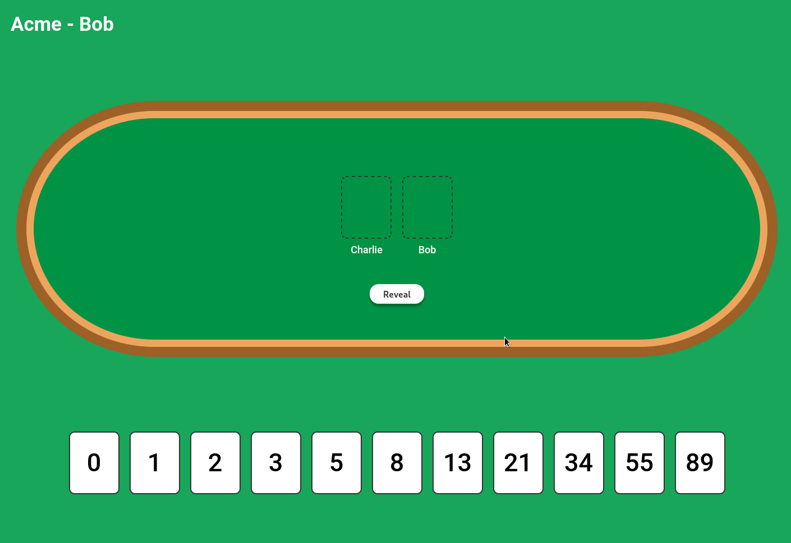

# Planning Poker
> Estimate your tasks easily



This app provides a simple, real-time and easy-to-use interface to help your team estimate the tasks in your sprints.

### Built with
- [React](https://reactjs.org/)
- [NodeJs](https://nodejs.org/en/)
- [TypeScript](https://www.typescriptlang.org/)
- [Styled Components](https://styled-components.com/)
- [Socket.io](https://socket.io)

## Getting Started
To make the app run is a very straightforward process:

```bash
yarn
yarn build
yarn start
```

It will spin-up a server on the port `8080`.

You can change this with the `REACT_APP_API_PORT` environment variable:
```
REACT_APP_API_PORT=80 yarn start
```

## Development
To make changes in the repository and use the dev environment:
```bash
yarn
yarn dev
```

## Deploying
When you deploy the application you will probably want to change the `REACT_APP_API_PORT` and `REACT_APP_API_DOMAIN` environment variables:
```bash
REACT_APP_API_PORT=80 REACT_APP_API_DOMAIN=myplanningpai.com yarn build

# You don't need the domain to start
# Don't forget to use the same port when you start the API
REACT_APP_API_PORT=80 yarn start
```

## License

Distributed under the MIT License. See `LICENSE` for more information.
